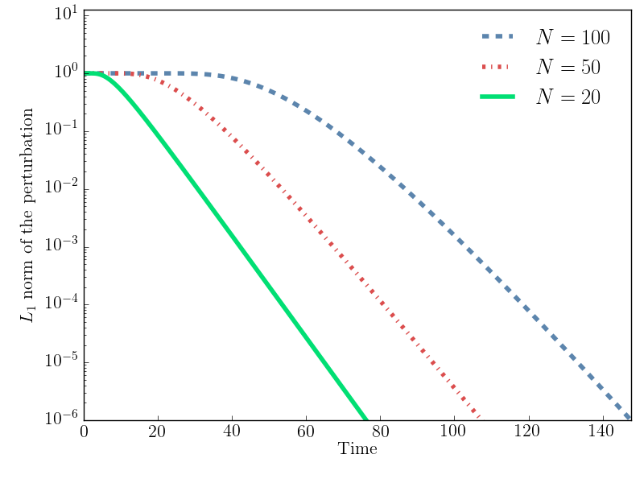
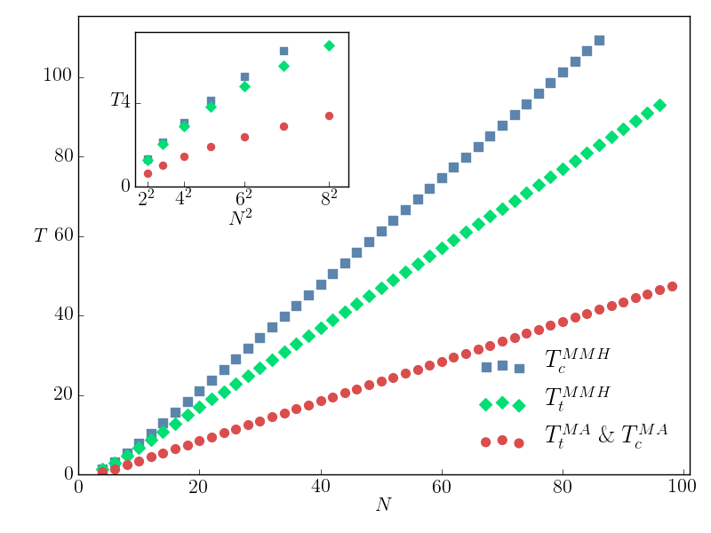
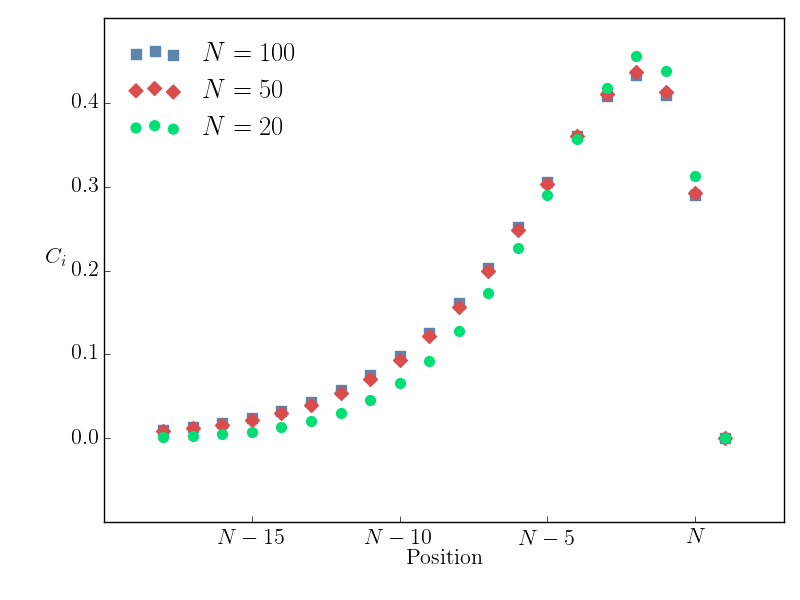
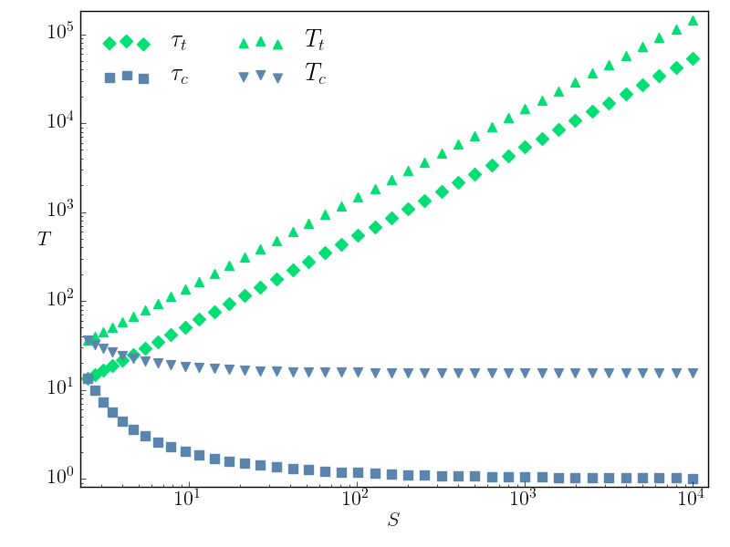
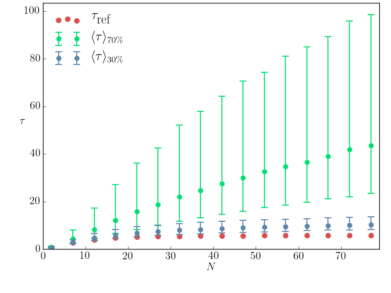

# Short relaxation times but long transient times in both simple and complex reaction networks #

**Adrien Henry and Olivier C. Martin**

> When relaxation towards an equilibrium or steady state is exponential at large times, one usually considers that the associated relaxation time τ , i.e., the inverse of the decay rate, is the longest characteristic time in the system. However that need not be true, other times such as the lifetime of an infinitesimal perturbation can be much longer. In the present work we demonstrate that this paradoxical property can arise even in quite simple systems such as a linear chain of reactions obeying mass action kinetics. By mathematical analysis of simple reaction networks, we pin-point the reason why the standard relaxation time does not provide relevant information on the potentially long transient times of typical infinitesimal perturbations. Overall, we consider four characteristic times and study their behavior in both simple linear chains and in more complex reaction networks taken from the publicly available database “Biomodels”. In all these systems, whether involving mass action rates, Michaelis- Menten reversible kinetics, or phenomenological laws for reaction rates, we find that the characteristic times corresponding to lifetimes of tracers and of concentration perturbations can be significantly longer than τ.

This project contains all the code needed to produce the data of the paper. Most of the function used are stored in two modules

* *LinearChain* contains tools that simplify the work with linear chain models.

* *NetworkComponents* contains tools to deal with published SBML models. It allows SBML reading, model separation of forward and backward fluxes, computation of characteristic times.

Samples of codes, stored in *ipython notebooks*, shows the used of some of these function to produce the figures of the paper.

## Decay for a tracer metabolites (figure 1) ##

[notebook](./tracer_decay.ipynb)

##  Variation of the times with the network length (figure 2) ##

[notebook](./timeVslength.ipynb)

## Slowest eigen mode profile (figure 3) ##

[notebook](./profile_slowest_mode.ipynb)

##  Variation of the times with the saturation (figure 4) ##

[notebook](./timeVsSatur.ipynb)

##  Variation of the times with the disorder (figure 5) ##

[notebook](./compute_disorder.ipynb)

## Measuring time in published SBML networks ##

[notebook](./time_real_networks.ipynb)
